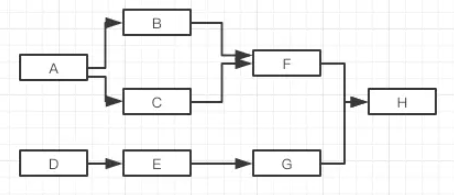
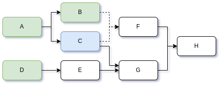

# 带依赖关系的任务编排

工作中的项目也曾碰到过这种场景。

看到了一个京东开源的工具 [aysncTool](https://gitee.com/jd-platform-opensource/asyncTool)， 称实现了下面功能：

+ **支持任意编排**

  比如多个任务串行执行（顺序依赖）、并行执行（无依赖）、阻塞等待（一个任务依赖多个）、串并行相互依赖等。

  比如一个比较复杂的包含依赖关系的任务编排案例：

  

+ **支持每个任务的执行结果回调**

+ **支持强依赖和弱依赖**

  强依赖：目标任务执行前必须先等待完成所有强依赖的任务。

  弱依赖：如果目标任务依赖的都不是强依赖，那么就可以任意一个依赖项执行完毕，就可以执行目标任务。

  其实作者这里想表达**全部**和**任一**的概念，说强依赖和弱依赖有点迷惑，不存在一个任务的依赖中既有强依赖又有弱依赖的情况。

+ **支持上游执行结果作为下游传参**

+ **支持设置全组任务超时时间**

+ **高性能、低线程数**

这里拓展讨论下任务编排的实现方案及优劣对比：

+ CompletableFuture

  功能比较简单；

  无法支持多依赖任务的结果传参给下游任务。

  CompletableFuture 实现上述包含复杂依赖关系的任务编排：async-future/top.kwseeker.async.future.jdAsyncTool.ComplexScene.java。

+ 自己设计框架

  基于监听回调

+ asyncTool

+ gobrs-async

+ Quasar / Loom

+ 任务调度框架

  一些任务调度框架也实现了带依赖关系的任务编排功能。

  + Celery

+ 工作流框架

  任务编排其实和工作流任务编排类似。

  + Workflow
  + Activity

图表对比：


## 自行设计实现asyncTool描述的功能

感觉这个asyncTool描述的功能实现起来也比较简单，为了不被其他框架带节奏，先自行设计一个简单实现，然后对比其他实现。

先分析每个需求怎么实现：

+ 支持任意编排

  任务的依赖关系有两种：前置依赖（依赖其他任务）、后置依赖（被其他任务依赖），

  前置依赖和后置依赖都可能有0、1到多个。

  数据结构设计：

  ```java
  //任务名，通过这个字段唯一代表一个任务
  private final String name;
  //前置依赖任务，当前任务依赖的任务
  private Map<String, Task> prevTasks = new HashMap<>();
  //后置依赖任务，当前任务被依赖
  private Map<String, Task> postTasks = new HashMap<>();
  ```

+ 支持每个任务的执行结果回调

  给任务注册监听器就行，任务执行完毕回调其所有监听器；

  另外为了防止轮询等待任务执行完毕造成性能和资源损耗，使用回调触发后置依赖任务的执行。

+ 支持强依赖和弱依赖

  强依赖（默认）：（全部依赖都执行了才执行）每个任务都包含前置依赖任务的引用，检查所有强依赖前置任务完成状态，都完成才能执行，后置依赖任务依靠它的前置依赖任务触发，前置依赖。

  弱依赖：（任一依赖任务执行就执行）由于后置依赖任务依靠它的前置依赖任务触发，所以不需要检查全部依赖都完成，但是弱依赖可能需要取消其他的未完成的依赖任务，如果需要取消的依赖任务还有依赖，也要取消，不过还有可能依赖的任务还被其他任务依赖，怎么处理？

  比如：F弱依赖于B、C，下图中其他依赖都是强依赖，B先执行完毕，C尚未执行或未执行完毕，这里由于存在 C->G->H的强依赖，所以不能取消任务C；如果G也弱依赖于C、E呢？如果H也弱依赖于F、G呢？（这时C是否应该取消的判断就变得很复杂）

  

  暂时只想到一种方法可以减少部分任务的执行：每个任务都保存其最终任务的引用（可能多个），每个任务触发前都判断下其所有最终任务是否都已经开始执行或结束，如果是，则此任务无需继续执行。

  > 这里弱依赖的任务取消是难点。

+ 支持上游执行结果作为下游传参

  上游任务完成才提交下游任务，上游的结果直接放到下游任务中提交给线程池。

+ 支持设置全组任务超时时间

  可以给编排的任务封装一个组，每个组设置一个定时任务，到期检查全部尾部任务是否都完成（任务中加一个state记录状态），未完成的话取消正在执行的任务，抛超时异常；

  全组任务提前完成则设置completed状态，并清除定时任务。

+ 高性能、低线程数

  这个属于优化范畴的，可以先忽略。

代码实现：java-async/async-orchestration。
