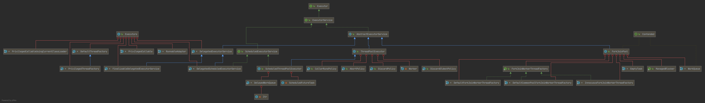
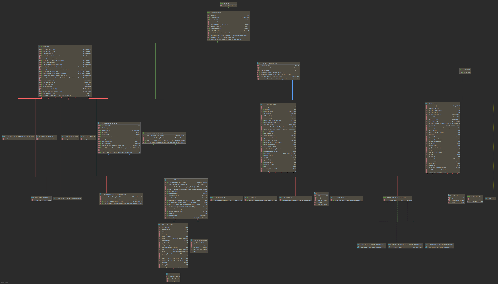

# Executor 族线程池

**线程池相关类**：



**线程池相关类方法**：

Java并发包线程池包含下面实现：

```java
ThreadPoolExecutor
	ScheduledThreadPoolExecutor
ForkJoinPool
DelegatedExecutorService in Executors		//线程池代理,并没有创建线程池
	DelegatedScheduledExecutorService in Executors
	FinalizableDelegatedExecutorService in Executors
```


## ThreadPoolExecutor

### 接口方法

#### ExecutorService

 


### ScheduledThreadPoolExecutor


## ForkJoinPool


